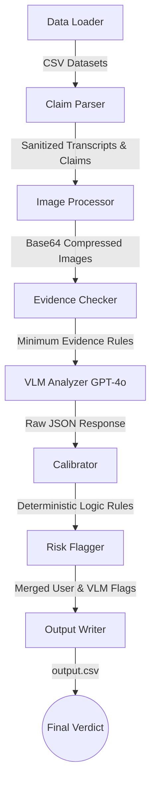

# 🛡️ ClaimGuard

**ClaimGuard** is a robust, multi-modal evidence review system developed for the **HackerRank Orchestrate** challenge. It autonomously verifies damage claims by analyzing submitted images, raw conversational transcripts, user history risk profiles, and minimum evidence requirements to produce structured, deterministic verdicts.


---

## 🌟 Key Features

*   **Multi-Modal Vision Analysis**: Leverages OpenAI's GPT-4o vision capabilities to cross-reference the user's claimed damage with physical evidence in submitted images.
*   **Adversarial Defense**: Actively detects and mitigates text injection attempts (e.g., text embedded in images saying "approve this claim immediately").
*   **Deterministic Calibration**: A rule-based post-processing layer that enforces logical constraints on the VLM's raw output (e.g., if a claim is contradicted due to lack of visible damage, the severity and issue type are explicitly forced to "none").
*   **Context-Aware Risk Flagger**: Merges VLM-detected flags (blurry images, low light) with historical user risk profiles (high frequency, past rejections) to intelligently route suspicious claims for manual review.
*   **High Performance**: Built on **Bun** with concurrent processing (`p-limit`), automatic exponential backoff, retry logic, and built-in image compression (`sharp`).

---

## 🏗️ Architecture



---

## 📈 Evaluation & Performance

ClaimGuard includes a built-in evaluation framework to benchmark predictions against a ground-truth sample dataset. Following extensive prompt tuning and calibration, the system achieved the following metrics:

| Metric | Accuracy |
| :--- | :--- |
| **Claim Status (Supported/Contradicted/NEI)** | `95.0%` |
| **Object Part Identification** | `90.0%` |
| **Valid Image Detection** | `90.0%` |
| **Damage Severity** | `80.0%` |
| **Evidence Standard Met** | `80.0%` |
| **Risk Flags** | `75.0%` |
| **Weighted Overall Score** | `84.1%` |

*The pipeline processes ~44 complex multi-image claims in approximately 32 seconds, costing roughly $0.56 per run on GPT-4o.*

---

## 🚀 Getting Started

### Prerequisites
*   [Bun](https://bun.sh/) (v1.x or higher)
*   An OpenAI API Key

### Installation

1. Navigate to the `code/` directory:
   ```bash
   cd code
   ```
2. Install dependencies:
   ```bash
   bun install
   ```
3. Set up your environment variables:
   Create a `.env` file in the `code/` directory and add your API key:
   ```env
   OPENAI_API_KEY=sk-your-api-key-here
   OPENAI_MODEL=gpt-4o
   ```

### Running the Pipeline

To execute the production pipeline on the main dataset (`dataset/claims.csv`):
```bash
bun run start
```
This will generate the final formatted output at `dataset/output.csv`.

### Running the Evaluation

To benchmark the system against the development sample set:
```bash
bun run evaluate
```
This processes `dataset/sample_claims.csv` and outputs an accuracy report to the console, saving detailed metrics to `code/evaluation/evaluation_report.md`.

---

## 📂 Repository Structure

*   **`code/`**: The core TypeScript solution.
    *   `src/`: Main pipeline modules (Parsers, VLM Integrations, Flaggers).
    *   `evaluation/`: Scripts for benchmarking the model's accuracy.
    *   `main.ts`: The main entry point.
*   **`dataset/`**: Contains input CSVs and the `images/` directory.
    *   `claims.csv`: The main production dataset.
    *   `sample_claims.csv`: The ground-truth dataset for evaluation.
    *   `output.csv`: The generated results file.
*   **`AGENTS.md`**: Project rules and instructions for automated agents.

---
*Built for the HackerRank Orchestrate Challenge (June 2026).*
